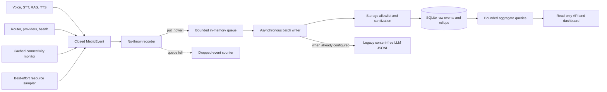
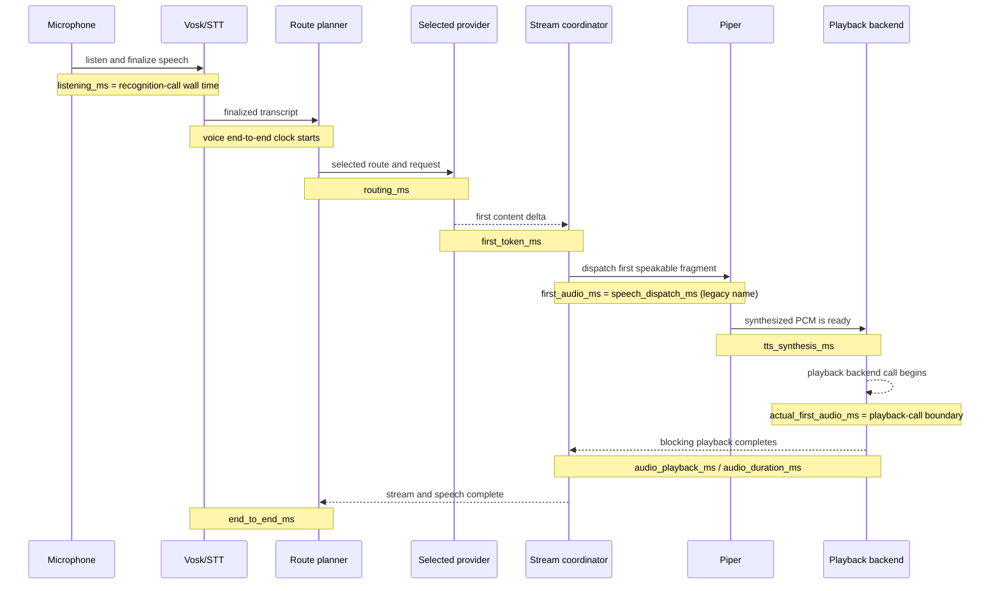

# KPI observability and dashboard

Helios includes an optional, content-free KPI subsystem for measuring the voice
pipeline, hybrid LLM routing, network quality, and best-effort device resource
use. It is built entirely with the Python standard library: a bounded queue,
background threads, SQLite, a small HTTP server, and committed static
HTML/CSS/JavaScript. It does not require Internet access, a frontend toolchain,
root privileges, or an additional Python package.

Collection and the dashboard are both disabled by default. When collection is
disabled, the normal assistant path keeps its existing behavior. When collection
is enabled, metric construction and queue insertion are best-effort: a full
queue, database error, unavailable resource source, or dashboard failure must
not fail recognition, routing, inference, RAG, TTS, or playback.

## Architecture and data flow

Voice, routing, provider, network, and resource producers emit a closed
`MetricEvent`. They cannot add arbitrary fields. The recorder stamps and
validates the event, retains only a bounded diagnostic snapshot in memory, and
uses a non-blocking insertion into a bounded queue. One background writer
sanitizes and batches accepted events into SQLite. Queue overflow increments a
dropped-event counter instead of applying backpressure to inference.



SQLite owns schema migration, indexed time-range storage, retention, size
enforcement, and rollups. The writer owns its database connection. Dashboard
requests use the query service rather than sharing the writer connection. On
shutdown, producers stop, pending batches receive a bounded final-flush attempt,
and the sampler, server, database connections, and worker threads close.

The legacy LLM JSONL sink remains a separate compatibility output configured by
the routing TOML and `HELIOS_LLM_METRICS_ENABLED`. Enabling KPI SQLite does not
silently reinterpret that file. When both outputs are active, best-effort fanout
keeps a failure in either sink from affecting the other or the assistant.

## Dashboard architecture

The dashboard uses ordinary GET requests and polls every 10 seconds. It does not
use WebSockets, SSE, a CDN, third-party scripts, or a build step. The same server
returns the committed static assets and the versioned read-only API. It remains
usable with an empty database and shows unavailable values rather than inventing
zeroes.

```mermaid
flowchart LR
    Main[main.py background service] --> Server[stdlib dashboard server]
    CLI[scripts/kpi.py serve] --> Server
    Browser[Desktop browser] --> Auth{Loopback or valid Basic/Bearer auth}
    Auth --> Static[Static HTML, CSS, JavaScript]
    Auth --> API[/api/v1/kpi/*]
    API --> Validation[Strict filters, ranges, and limits]
    Validation --> Query[KPI query service]
    Query --> ReadOnly[Read-side SQLite connection]
    ReadOnly --> Database[(KPI SQLite)]
    Static --> Browser
    API --> Browser
```

The interface contains Overview, Routing, Latency, Network, and Jetson sections.
Filters cover time window, `talk`/`think` mode, local/remote locality, provider,
model, route, success/failure outcome, and network-quality tier. A filter affects
the related summary, distribution, latency, network, and resource queries.
Missing numeric values render as `—`; a measured zero remains zero. If one
request fails, the update banner names the unavailable API resource instead of
silently converting missing data to zero. Overview can derive an observed
health/locality summary from successful provider samples when the live health
resource is temporarily unavailable.

### Read-only API

The API prefix is `/api/v1/kpi/`. Only GET and HEAD are accepted.

| Resource | Purpose |
|---|---|
| `health` | Sanitized service and storage availability |
| `summary` | Counts, rates, costs, and headline latency percentiles |
| `timeseries` | Bounded series for allowlisted numeric KPIs |
| `latency` | Latency samples, percentiles, and distributions |
| `routing` | Local/remote share, tiers, reasons, and fallback paths |
| `providers` | Provider/model outcomes and circuit state |
| `network` | Connectivity, quality, timing, goodput, and routing relationship |
| `resources` | CPU, GPU, memory, temperature, power, and storage series |
| `export` | Sanitized JSON or CSV when export is enabled |

Common query parameters are `window` or the pair `start`/`end`, plus `mode`,
`locality`, `provider`, `model`, `route`, `outcome`, and `network_tier`.
`window` uses a positive number followed by `m`, `h`, or `d`, such as `30m`,
`6h`, or `7d`. Explicit timestamps must be RFC 3339. The server rejects unknown,
duplicate, blank, malformed, or over-limit parameters before calling storage.
Point counts, row counts, response size, target length, and time range are all
bounded by configuration and server limits. Errors are generic and do not
include database paths, queries, credentials, or stored values.

## Request timeline and latency semantics

Durations are recorded in milliseconds using monotonic clocks. Persisted event
timestamps are UTC. A field is `null` or absent from an aggregate when the
relevant boundary is not observable; unavailable is not treated as zero.



`actual_first_audio_ms` is the real production playback-call boundary: production
Piper captures `audio_started_at` immediately before invoking the playback
backend. It is the closest instrumented perceived-audio KPI, but it is not an
acoustic measurement at the listener's ear and can exclude device buffering.
The dashboard prefers this value. If the active TTS implementation cannot expose
timing, the card falls back to `first_audio_ms`, the historical time to dispatch
the first speakable fragment to TTS. `speech_dispatch_ms` is the explicit name
for that same fallback boundary.

Listening and STT compute time are deliberately distinct. `listening_ms` is the
wall time for the recognition/listening call, including waiting for speech and
finalization. `stt_ms` remains unavailable unless the recognition engine exposes
a separate content-free compute duration; Helios does not copy listening wall
time into it.

`PiperTTS.speak(text)` retains its historical `None` return value for callers.
Instrumentation uses the internal `speak_with_timing(text)` path to obtain
content-free `SpeechTiming`; injected or legacy TTS implementations that only
provide `speak()` leave playback-boundary timing unavailable.

### Latency definitions

| Field | Definition |
|---|---|
| `listening_ms` | Wall time spent in one recognition/listening call, including waiting and finalization |
| `speech_finalization_ms` | Time attributable specifically to endpoint/final-result finalization, when supplied |
| `stt_ms` | Engine-reported speech-to-text compute duration; unavailable when the engine does not expose it |
| `rag_ms` | Retrieval and result-validation time before speaking the RAG answer |
| `routing_ms` | Request-planning time from route evaluation start to a routing decision |
| `latency_ms` | Total wall time of one provider attempt, including observed speech work performed inside that attempt |
| `inference_ms` | Attempt wall time less measured TTS synthesis and blocking playback; it includes provider streaming and coordinator overhead |
| `first_token_ms` | Attempt/request start to the first provider content delta |
| `first_audio_ms` | Legacy attempt/request start to first speech dispatch; identical in meaning to `speech_dispatch_ms` and used only as the dashboard fallback |
| `actual_first_audio_ms` | Attempt/request start to the production clock captured immediately before the first playback-backend call; the preferred dashboard value |
| `tts_synthesis_ms` | Sum of Piper synthesis time for all spoken fragments in the measured operation |
| `audio_playback_ms` | Sum of blocking playback wall time for all measured fragments |
| `audio_duration_ms` | Sum of nominal PCM waveform duration, independent of playback overhead |
| `streaming_lead_ms` | Remaining attempt wall time after actual first audio starts; positive values show that speech began before the attempt finished |
| `end_to_end_ms` | Terminal wall time for the event scope: API invocation to LLM completion for `llm_request_*`, or finalized transcript to command completion for `voice_command_*` |

Do not compare latency fields from different event scopes without filtering the
event family. In particular, attempt latency and voice-command end-to-end latency
have different starting boundaries.

## KPI definitions and units

### Voice pipeline

| KPI | Unit or type | Interpretation |
|---|---|---|
| Listening/STT/finalization/RAG/TTS/playback timings | milliseconds | Stage durations defined above, when observable |
| Wake-word detections | count | Accepted wake-word events |
| Recognized commands | count | Final recognition results dispatched by the assistant |
| Cancellations and interruptions | count | Cancelled operations and failures after speech commitment |
| Finalized transcript to first playback call | milliseconds | `actual_first_audio_ms` when the production playback boundary is available |
| Complete response | milliseconds | `voice_command_*` `end_to_end_ms` |

### LLM routing and providers

| KPI | Unit or type | Interpretation |
|---|---|---|
| Request and attempt counts | count | Requests are terminal `llm_request_*` outcomes; attempts include retries and fallbacks |
| Mode | enum | `talk` or `think` |
| Locality | enum | `local` or `remote` |
| Provider, model, resolved model, route | configured label | Selected execution identity; never an endpoint or credential |
| Model tier | configured label | Adaptive tier such as the configured Luna/Terra/Sol target |
| Complexity score | non-negative integer | Local explainable routing score |
| Routing/rejection/fallback reason | controlled label | Why a route was selected, rejected, or replaced |
| Retry/fallback count | count | Additional same-target attempts and route changes before speech commitment |
| Circuit state | enum | Provider/model health transition state |
| Timeout/error category | enum | Sanitized failure classification rather than exception text |
| First token/audio and inference latency | milliseconds | Boundaries defined in the latency table |
| Input/output/reasoning/total tokens | token count | Provider-reported usage when present |
| Estimated input/output tokens | token count | Local conservative estimate when reported usage is unavailable or for preflight routing |
| Reported/estimated cost | USD decimal | Catalog-based amount; never infer a price without a current validated catalog |
| Refusal, cancellation, interruption | count | Terminal controlled outcomes |

### Network quality

| KPI | Unit or type | Interpretation |
|---|---|---|
| Connectivity | enum | `online`, `offline`, or `unknown` cached decision |
| Interface available | boolean | Whether the passive gate found an eligible interface; its name/address is not stored |
| Probe success and ratio | boolean / ratio 0–1 | Latest result and recent success ratio |
| DNS/TCP/TLS/TTFB | milliseconds | Timed stages from the existing bounded HTTPS probe |
| Goodput | kilobits per second | Payload goodput from the rate-limited probe when enough bytes were received |
| Quality score | ratio 0–1 | Existing smoothed heuristic combining latency, jitter, loss, goodput, and signal evidence |
| Quality tier | enum | `offline`; `unknown`; `poor` below 0.25; `fair` below 0.50; `good` below 0.75; otherwise `excellent` |
| Network-forced local | boolean/count | Routing decisions where cached path state or quality excluded remote targets |
| Network reason | controlled label | Stale probe, captive/invalid path, passive-gate, or quality decision without an address |

KPI collection does not add a second network probe. It consumes the existing
cached connectivity snapshot and transition callback, so voice requests do not
wait for network measurement and observability does not increase probe cadence.

### Device resources

| KPI | Unit or type | Source |
|---|---|---|
| CPU/GPU utilization | percent 0–100 | `/proc/stat` deltas and, when available, `tegrastats` |
| RAM/swap used and utilization | MiB / percent | `/proc/meminfo` or `tegrastats` fallback |
| CPU/GPU temperature | degrees Celsius | thermal sysfs or `tegrastats` |
| Power | watts | Jetson `tegrastats`, with an INA3221 sysfs fallback for `VDD_IN`, `POM_5V_IN`, `VIN_SYS_5V0`, or `SYS5V` |
| CPU/GPU frequency | MHz | Active-core/GR3D `tegrastats`; GPU devfreq `cur_freq` is the fallback when GR3D frequency is absent |
| Throttled | boolean | A supported sanitized throttle state when present |
| KPI storage used | MiB | Filesystem/SQLite storage accounting |

### Derived aggregates

- Success rate is successful terminal requests divided by terminal requests.
- Local and remote success rates apply the same formula after locality filtering.
- Fallback rate is terminal requests with a positive fallback count divided by
  terminal requests.
- Error and timeout rates group terminal failures or failed attempts by their
  controlled category, provider, and model.
- Local/remote traffic ratio and model-tier distribution count routing/terminal
  records, rather than summing percentages.
- Requests per minute divides terminal requests by the selected window duration.
- Token and cost totals sum compatible reported or explicitly estimated fields.
  A total is zero when the selected records contain no value for that field;
  treat it as "not reported in this selection," not proof of zero usage or cost.
- Resource comparisons select samples overlapping local or remote activity and
  keep the selected scope visible.
- Talk/think and local/remote comparisons use the same aggregate definition with
  different filters.
- p50, p90, p95, and p99 use exact Hyndman/Fan type-7 interpolation over the
  underlying raw samples for the requested window. Stored or displayed
  percentiles are never averaged together.

## Installation

No KPI-specific package installation is required. Install Helios normally for
the target platform. Python provides SQLite and the HTTP server; dashboard assets
are committed under `observability/static/`. The feature works offline.

The dashboard accepts empty API query strings consistently on Python 3.10.0,
including the version present on early JetPack images. SQLite migrations avoid
syntax that requires a newer SQLite runtime than those deployments provide.

The source-checkout installation and Jetson backend rules in the main README
remain unchanged. In particular, do not replace JetPack-compatible Torch or ONNX
Runtime to install observability.

## Configuration

Helios reads process environment variables; it does not load `.env` files. All
KPI settings are immutable and validated. An invalid KPI override logs a
sanitized error and disables collection and the dashboard rather than weakening
dashboard access rules or changing assistant routing.

| Variable | Default | Purpose |
|---|---:|---|
| `HELIOS_KPI_ENABLED` | `false` | Record sanitized KPI events and device samples |
| `HELIOS_KPI_STORAGE_PATH` | `logs/helios-kpi.sqlite3` | SQLite path; relative paths resolve from the project root |
| `HELIOS_KPI_QUEUE_SIZE` | `2048` | Maximum pending in-memory events |
| `HELIOS_KPI_BATCH_SIZE` | `64` | Maximum events per asynchronous write batch |
| `HELIOS_KPI_FLUSH_INTERVAL_SECONDS` | `0.5` | Maximum routine delay before flushing a partial batch |
| `HELIOS_KPI_RAW_RETENTION_DAYS` | `14` | Raw-event retention |
| `HELIOS_KPI_ROLLUP_RETENTION_DAYS` | `90` | Aggregate-rollup retention; cannot be shorter than raw retention |
| `HELIOS_KPI_MAX_DATABASE_MB` | `256` | Configured database-size ceiling |
| `HELIOS_KPI_ROLLUP_INTERVAL_SECONDS` | `300` | Rollup/maintenance interval |
| `HELIOS_KPI_RESOURCE_INTERVAL_SECONDS` | `5.0` | Best-effort device sampling interval |
| `HELIOS_KPI_DASHBOARD_ENABLED` | `false` | Start the dashboard with the assistant |
| `HELIOS_KPI_DASHBOARD_HOST` | `127.0.0.1` | Dashboard bind host |
| `HELIOS_KPI_DASHBOARD_PORT` | `8765` | Dashboard bind port |
| `HELIOS_KPI_DASHBOARD_ALLOW_LAN` | `false` | Required explicit opt-in for a non-loopback bind |
| `HELIOS_KPI_DASHBOARD_AUTH_TOKEN_ENV` | unset | Name of the environment variable containing the Basic/Bearer dashboard token; not the token itself |
| `HELIOS_KPI_EXPORT_ENABLED` | `true` | Enable sanitized CLI/API export |
| `HELIOS_KPI_MAX_EXPORT_ROWS` | `10000` | Maximum rows in one export |
| `HELIOS_KPI_MAX_QUERY_DAYS` | `31` | Maximum API time range |
| `HELIOS_KPI_MAX_QUERY_POINTS` | `1000` | Maximum requested time-series points |

The batch size cannot exceed the queue size. Numeric limits and intervals must
be finite and positive, the port must be 1–65535, and non-loopback automatic
dashboard startup requires both LAN opt-in and a valid authentication-token
environment-variable name. Every non-loopback bind requires a token containing
at least 24 characters.

### Enable collection and start with the assistant

```bash
export HELIOS_KPI_ENABLED=true
export HELIOS_KPI_DASHBOARD_ENABLED=true
export HELIOS_KPI_DASHBOARD_HOST=127.0.0.1
export HELIOS_KPI_DASHBOARD_PORT=8765
python main.py
```

On Jetson, use the normal launcher instead of invoking `main.py` directly:

```bash
python3 scripts/run_jetson.py
```

If KPI initialization or the dashboard bind fails, Helios logs a sanitized
warning and continues the assistant without the failed optional component.

### Serve an existing or empty store separately

The explicit CLI command is itself the dashboard opt-in, so it can serve the
configured store without setting `HELIOS_KPI_DASHBOARD_ENABLED=true`. It does not
run the assistant or collect new voice events.

```bash
python scripts/kpi.py serve
```

Open <http://127.0.0.1:8765/>. An empty store renders empty-state cards and
tables.

## Secure dashboard access

### Recommended: SSH port forwarding

Keep the dashboard bound to loopback on the Jetson and run this from the desktop:

```bash
ssh -L 8765:127.0.0.1:8765 emilia@<jetson-address>
```

Then open <http://127.0.0.1:8765/> on the desktop. This does not require a LAN
bind and keeps dashboard traffic inside SSH.

### Explicit LAN binding and Basic/Bearer authentication

A non-loopback bind is rejected unless LAN access is explicitly allowed and a
dashboard token is available through a named environment variable. The token
must contain at least 24 characters for every non-loopback startup path; use a
random, high-entropy deployment secret:

```bash
export HELIOS_KPI_DASHBOARD_ENABLED=true
export HELIOS_KPI_DASHBOARD_HOST=0.0.0.0
export HELIOS_KPI_DASHBOARD_ALLOW_LAN=true
export HELIOS_KPI_DASHBOARD_AUTH_TOKEN_ENV=HELIOS_KPI_DASHBOARD_TOKEN
export HELIOS_KPI_DASHBOARD_TOKEN='<high-entropy-deployment-secret>'
python3 scripts/run_jetson.py
```

The equivalent explicit server command is:

```bash
python scripts/kpi.py serve \
  --host 0.0.0.0 \
  --allow-lan \
  --auth-token-env HELIOS_KPI_DASHBOARD_TOKEN
```

For a browser, open the dashboard URL and answer its HTTP Basic authentication
prompt with username `helios` and the dashboard token as the password. API
clients can send the same secret as `Authorization: Bearer <token>`:

```bash
curl \
  -H "Authorization: Bearer $HELIOS_KPI_DASHBOARD_TOKEN" \
  http://<jetson-address>:8765/api/v1/kpi/health
```

Both authentication schemes protect static assets and API routes. The server
deliberately does not accept a token in the URL and does not provide a cookie
login form. The built-in server does not terminate TLS; Basic credentials or a
Bearer token sent over untrusted plain HTTP can be intercepted. SSH forwarding
or a reviewed TLS reverse proxy remains the recommended browser path.

## Storage, retention, and management

The default database is `logs/helios-kpi.sqlite3`. SQLite transactions provide
recovery after interruption. WAL mode is requested where the filesystem and
SQLite support it; the store falls back safely when WAL is unavailable. Schema
versions are migrated transactionally, writes are batched, and time-range query
columns are indexed.

Raw events older than `HELIOS_KPI_RAW_RETENTION_DAYS` are converted into
interval count rollups and then removed. Those count rollups are retained for
`HELIOS_KPI_ROLLUP_RETENTION_DAYS`. Numeric distributions are deliberately not
reconstructed from count rollups: latency percentiles and other sample-based
statistics are therefore limited to raw-event retention, while older rollups
can still support compatible counts and categorical rates.

Periodic maintenance also enforces `HELIOS_KPI_MAX_DATABASE_MB`. Under size
pressure it rolls up the oldest raw rows in bounded groups, then removes the
oldest rollup buckets if necessary, using checkpoints and incremental vacuum
where supported. It sacrifices the oldest eligible telemetry rather than
blocking the voice pipeline. A size ceiling is an operational bound, not a
promise that SQLite can truncate an active file to the exact byte immediately
on every filesystem.

Inspect sanitized storage status:

```bash
python scripts/kpi.py status
```

Clear raw events and rollups explicitly:

```bash
python scripts/kpi.py clear --yes
```

Without `--yes`, the command refuses the destructive operation. Disabling KPI
collection does not delete an existing database; use `clear --yes` only when
data removal is intended.

### JSON and CSV export

Exports contain only the storage allowlist. They are bounded by
`HELIOS_KPI_MAX_EXPORT_ROWS`, and CSV cells that could be interpreted as formulas
are neutralized.

```bash
python scripts/kpi.py export json --output helios-kpi.json --limit 1000
python scripts/kpi.py export csv --output helios-kpi.csv --limit 1000
```

Use `--output -` or omit `--output` to write to standard output. Set
`HELIOS_KPI_EXPORT_ENABLED=false` to disable both CLI export and the HTTP export
surface. The API also applies its configured time, point, row, and response-size
limits.

## Privacy guarantees

The KPI SQLite store, dashboard API, and exports never persist or return:

- prompts, finalized transcripts, conversation history, generated answers, or
  TTS text;
- retrieved passages, documents, tool inputs, or tool outputs;
- credentials, authentication headers, dashboard tokens, provider endpoints, or
  network probe URLs;
- provider request IDs, attempt IDs, conversation IDs, or other correlation IDs;
- interface names, MAC addresses, IP addresses, SSIDs, or peer addresses;
- raw exception bodies or arbitrary log messages.

The persisted schema allows controlled event names, configured provider/model
labels, low-cardinality routing/network states, booleans, counts, and finite
numeric measurements. Interface availability may be stored as a boolean and a
coarse allowlisted interface kind may be used during routing, but identifying
interface data is omitted. The dashboard authentication configuration stores
only the name of the token environment variable; the secret is resolved at
server startup and is never written to metrics.

The legacy optional LLM JSONL sink is distinct from the KPI database. It remains
content-free for compatibility, but operators that require the KPI store's exact
identifier-omission policy should disable or separately control the legacy file.
General application logs are also outside the KPI export contract and should
not be published without an operational privacy review.

## Jetson resource availability

Resource collection is best-effort and Helios itself must not run as root.

- Linux CPU and memory values use readable `/proc` files.
- Thermal values use readable thermal sysfs zones when labels identify CPU or
  GPU sensors.
- If `tegrastats` is on `PATH`, the sampler first requests a bounded single-shot
  sample. Older releases that do not implement `--count` fall back to a briefly
  bounded streaming invocation. Recognized RAM, swap, CPU, GR3D, temperature,
  power, clock, and throttle fields are parsed; unknown fields are ignored.
- When GR3D utilization is available without its clock, the sampler reads the
  GPU devfreq `cur_freq` sysfs attribute and converts hertz to megahertz.
- When `tegrastats` omits power, the sampler looks for the main-input INA3221
  rail under legacy IIO and current hwmon sysfs layouts. Supported labels are
  `VDD_IN`, `POM_5V_IN`, `VIN_SYS_5V0`, and `SYS5V`; legacy IIO values are
  milliwatts and hwmon microwatts are converted to milliwatts.
- Disk usage uses the cross-platform standard-library filesystem API.
- On Windows, ordinary Linux, containers, or Jetson images without a supported
  source, unavailable fields remain null while available disk or `/proc` values
  continue to work.

Missing `tegrastats`, an unsupported line format, missing sysfs files, permission
errors, timeouts, and command failures do not stop the sampler or the assistant.
Some Jetson images expose INA3221 attributes as root-readable even though jtop
can display them through its privileged service. Prefer narrowly scoped
udev/system-service permissions or leave power unavailable. Do not run Helios
as root merely to fill a dashboard field.

## Performance and benchmark method

The design keeps database and dashboard work off the inference thread, but
target overhead must be measured rather than assumed. This repository does not
claim a Jetson benchmark number without a reproducible run on the deployment
image.

Run the model-free synthetic benchmark from the repository root:

```bash
python scripts/benchmark_kpi.py --pretty
```

`scripts/benchmark_kpi.py` creates a temporary content-free SQLite database and
emits machine-readable JSON. It measures event-record call-duration percentiles,
asynchronous SQLite drain throughput, bounded raw-database query latency,
dashboard-summary query latency, deterministic full-queue/drop behavior and
traced memory growth, and portable `ResourceCollector` wall/process-CPU overhead.
The temporary database is removed after the run, external resource commands are
disabled for the portable sampler baseline, and no prompts, responses, IDs, or
deployment secrets are generated or recorded. Tune the workload with
`--events`, `--queries`, `--resource-samples`, and `--queue-size`; omit `--pretty`
for compact JSON. The tool reports measurements and never applies brittle timing
pass/fail thresholds.

Use an A/B procedure on the same Jetson, model, audio devices, network profile,
power mode, thermal state, and request corpus:

1. Warm the runtime, then run a fixed sequence with KPI disabled.
2. Repeat with KPI enabled and the dashboard disabled.
3. Repeat with the dashboard polling at its normal 10-second interval.
4. Measure `record()` call duration with `time.perf_counter_ns()`, queue depth and
   drops, batch throughput, database growth, summary-query latency, sampler CPU
   time, process RSS, and voice `actual_first_audio_ms`/`end_to_end_ms`.
5. Exercise a deliberately full queue and a slow/failing sink to confirm the
   assistant remains responsive and dropped counts increase.
6. Report sample count, median, p90, p95, p99, maximum, configuration, JetPack,
   Python/SQLite versions, and confidence or run-to-run spread. Do not average
   per-run percentiles; combine raw samples or report each run separately.

The model-free tests cover the bounded queue, asynchronous flush, drop/failure
statistics, parser fallbacks, callback shutdown, API limits, and static assets.
They verify behavior, not target-device performance.

## Troubleshooting

| Symptom | Action |
|---|---|
| No database or new rows | Set `HELIOS_KPI_ENABLED=true`, restart, execute a request, then run `python scripts/kpi.py status`. Invalid KPI configuration fails disabled. |
| Dashboard does not start with Helios | Set `HELIOS_KPI_DASHBOARD_ENABLED=true`; verify host/port availability and inspect the sanitized application warning. The assistant continues if startup fails. |
| `scripts/kpi.py serve` opens an empty dashboard | The command only serves the configured store. Enable collection in the assistant and confirm both processes use the same `HELIOS_KPI_STORAGE_PATH`. |
| Non-loopback bind is rejected | Set explicit LAN opt-in and a valid token environment-variable name/value, or use SSH forwarding with the loopback defaults. |
| Browser receives `401` | Enter HTTP Basic username `helios` and use the configured dashboard token as the password. Bearer remains available to API clients; both schemes protect static assets and API routes. |
| Export is refused | Ensure `HELIOS_KPI_EXPORT_ENABLED=true` and keep `--limit` at or below `HELIOS_KPI_MAX_EXPORT_ROWS`. |
| GPU displays `0%` | Confirm `GR3D_FREQ 0%` in a raw `tegrastats` sample. Zero is valid idle utilization; it is not the missing-value sentinel. |
| GPU frequency is blank | Check for a readable GPU devfreq `cur_freq` attribute. The sampler uses it only when the same `tegrastats` sample omits GR3D frequency. |
| Power is blank but jtop displays it | Locate the INA3221 main-input rail and verify that the normal Helios user can read both its label and power attribute. jtop may obtain the value through a privileged service; do not run Helios as root. |
| Other CPU/GPU/resource fields are blank | Check whether the relevant `/proc`, thermal sysfs, or `tegrastats` source is available to the normal service user. Blank is expected on unsupported or unreadable sources. |
| Drops increase | Increase the queue only within the device memory budget, reduce resource frequency, or diagnose storage latency. The recorder intentionally drops instead of blocking inference. |
| Database remains large after pruning | Inspect status, allow maintenance/checkpoint to run, reduce retention/size settings, or stop writers and use the explicit clear command if deletion is intended. |

## Disable or remove KPI data

Disable collection and automatic dashboard startup, then restart Helios:

```bash
export HELIOS_KPI_ENABLED=false
export HELIOS_KPI_DASHBOARD_ENABLED=false
python3 scripts/run_jetson.py
```

This preserves existing data for later inspection. To remove it, stop dashboard
readers and run `python scripts/kpi.py clear --yes`. To keep collection but
remove the export surface, set `HELIOS_KPI_EXPORT_ENABLED=false`.
